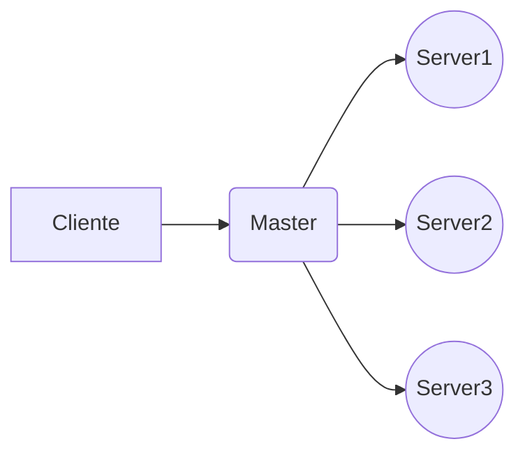

# Distributed Systems - PyCluster

**PyCluster** é um sistema distribuído de consulta de palavras chaves dentro de um determinado arquivo de txt. Sua base é construída sobre a framework Django que auxilia na manipulação dos hosts e interface de busca. 
**PyCluster** é um trabalho acadêmico com a finalidade explorar a distribuição de informações visando processar grande volume de informações.

# Requirements

Para utilização do PyCluster faz-se necessário a instação das ferramentas a seguir:

Python 2.7
Django 1.11
Pip 2

Run commands

    pip install requests
    pip install Werkzeug
    pip install pusher
    pip install psutil

## Config Real-time Pusher

Configure o pusher no server.py na raiz do projeto e view.py no modulo master>server.

Cadastre-se no pusher para ter acesso ao serviço de push:
[Clique aqui para acessar o site oficial do pusher](https://pusher.com)

    pusher_client = pusher.Pusher(
	  app_id='sua_api_id',
	  key='sua_key',
	  secret='sua_secret',
	  cluster='us2',
	  ssl=True
	)

## Run Project

Para iniciar o projeto starte o django (Master)

    ./manage.py runserver seu_ip:8000

Inicie o servidor em cada maquina que irá fazer o processamento. (Slave)

    python server.py

## Esquema
Funcionamento do PyCluster

 - O **cliente** acessa a pagina index fazendo o upload do arquivo txt e inserindo as palavras chaves.
 - **Master** Faz a quebra do arquivo, divide para os servers e envia-os com uma thread.
 - **Servers** processam a informação fazendo a contagem das ocorrências encontradas e retornam para o master

